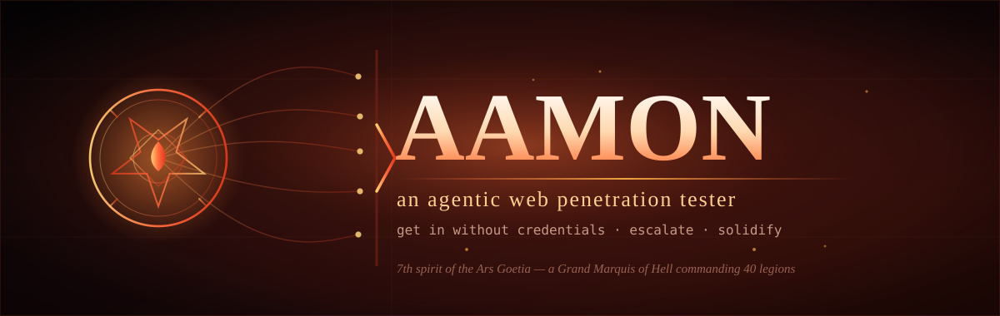

<p align="center">
  
</p>

<h1 align="center">Aamon</h1>

<p align="center"><em>An autonomous web-application penetration tester that works to get in — and then to get root.</em></p>

---

Aamon is an autonomous offensive-security agent for **web applications and their APIs** (REST, SOAP,
GraphQL). Give it an authorized target and a one-page brief, and it does what a human red-teamer does:
maps the attack surface, hunts for a way in that needs no credentials, takes that foothold as far as it
goes, and writes the whole thing up. It is built on the [eve](https://eve.dev) agent framework and runs
its tooling inside a disposable sandbox.

It is named after a figure from the *Ars Goetia* — a spirit said to command forty legions and to preside
over life and reproduction. The metaphor earns its keep: Aamon does not work one thread at a time. It
splits into background subagents that attack in parallel, each chasing its own lead, and folds their
results back into one account of how the application falls. It reproduces to cover ground, and it
persists — holding a foothold, deepening it, and climbing — the way a patient attacker does.

## What it goes after

Aamon optimizes for **access**, not for a long list of hygiene nits. Its objectives, in order:

1. **Break in without credentials.** A session that isn't yours, a user you can impersonate, an
   authenticated state reached with no password — through auth bypass, broken access control, account
   takeover, SSRF or RCE, token forgery, or a chain of smaller bugs.
2. **Escalate.** Sideways to other users and tenants, upward to admin or superuser.
3. **Consolidate.** Chain the findings, reach the backend, and show how far the compromise actually goes.

Misconfigurations and missing headers still get recorded, but they are footnotes. A proven path in,
demonstrated with a deliberately minimal and non-destructive proof, is the headline.

## How it behaves

Aamon is **autonomous by default**. It does not stop to ask permission for each exploit — within an
authorized scope it runs the bypass, fires the injection, forges the token, and escalates on its own,
start to finish, and delivers a report at the end.

Exactly two rules constrain it, and it enforces both itself:

- **Scope.** It records an authorized scope up front and checks every target against it before acting.
  Anything outside that scope is off-limits, always.
- **Do no harm.** It never does anything that could take the target down or corrupt its data — no
  denial-of-service, no destructive or state-changing actions, no mass data theft. Where a technique
  would cross that line (volume brute-force, request smuggling, cache poisoning), it uses a safe proof
  instead, or notes it as a follow-up rather than running it.

> ⚠️ **Only point Aamon at systems you own or are explicitly authorized to test.** It is an offensive
> tool that will attempt real exploitation. Unauthorized use is illegal.

## Knowledge

Aamon carries the working knowledge of a senior web pentester as a set of skills it loads when a task
calls for them, each going a layer deeper than the last:

| Skill | What it brings |
| --- | --- |
| `pentest-methodology` | The phased, iterative approach and when to reach for each other skill. |
| `owasp-reference` | OWASP WSTG test cases, Top 10, API Security Top 10, and ASVS — the baseline checklist. |
| `test-web-and-webservices` | End-to-end method for testing an app and its APIs. |
| `initial-access` | The credential-less ways in, as a prioritized playbook. |
| `privilege-escalation` | Climbing and consolidating once there's a foothold. |
| `web-attack-techniques` | Each vulnerability class and the sandbox tool that fits it. |
| `cve-hunting` | Fingerprinting components and verifying their known CVEs against live feeds. |
| `engagement-briefing` · `engagement-planning` · `findings-report` | Intake, the living test plan, and the report. |

Standards it follows: OWASP WSTG, Top 10, API Security Top 10, and ASVS; NIST SP 800-115; MITRE CWE;
CVSS 3.1. The checklists are a floor — the findings that matter most are the ones no checklist names.

## Quick start

Requires Node.js 24+. `eve` is installed as a local dependency.

```bash
npm install
npm run dev        # launches the eve dev TUI; paste a briefing to begin
```

A briefing is a short scoping document: the authorized in-scope URLs or hosts, anything out of scope,
test accounts per role, the environment, and the rules of engagement. Aamon reads it, confirms the
scope back to you, maps the surface, works its plan over several passes, and compiles the report at
`engagement/report.md` (and to Slack — see below).

## Architecture

Everything that defines the agent lives under `agent/`, and eve compiles and runs it.

```
agent/
├── instructions.md        persona, mandate, boundaries, how it runs an engagement
├── agent.ts               model selection and per-session cost/time limits
├── sandbox.ts             disposable /workspace with a baked web-pentest toolkit
├── channels/              how you reach it: slack, HTTP intake, and the eve session API
├── tools/                 scope gate, engagement/plan/finding records, scans, finalize
├── skills/                the loadable knowledge above
├── lib/                   engagement model, report builder, scope and notify helpers
└── hooks/                 audit log of every command, tool, and result
```

- **The sandbox** bakes in a web-focused toolkit so runs start instantly: `nmap`, `nuclei` (templates
  pre-pulled), `httpx`, `katana`, `subfinder`, `gau`, `arjun`, `ffuf`, `gobuster`, `sqlmap`, `commix`,
  `dalfox`, `jwt_tool`, `wpscan`, `wafw00f`, `nikto`, `testssl`, `interactsh`, and `SecLists` — and Aamon
  installs or writes more on demand.
- **Everything is recorded.** A hook logs every command, tool call, and result to `engagement/audit.log`,
  giving a reproducible trail independent of the model. Engagement artifacts (scope, plan, findings,
  report, tool scripts, scan output) live under `/workspace/engagement/`.
- **The plan is a gate.** Aamon builds a concrete test backlog first and `finalize_engagement` refuses
  to close while any task is open, which forces the second and third passes where depth comes from.
- **Long scans don't stall it.** A single blocking scan can exceed the per-invocation time limit, so
  genuinely long runs are launched detached (`scan_start`) and polled (`scan_poll`), surviving restarts.
- **It fans out.** Independent workstreams run as background subagents across distinct hosts, sharing the
  sandbox and reconvening into one report.

## Running it as a service

Deploy to Vercel through eve and reach it over HTTP or from Slack.

```bash
npm run deploy     # eve deploy
```

### Slack

Slack is how Aamon takes direction and delivers reports. Add the channel with the guided setup (Vercel
Connect manages the bot token and verifies inbound events):

```bash
eve add channel/slack
```

Mention or DM the bot to start and steer an engagement; the finished report is posted to the channel
named by `AAMON_SLACK_CHANNEL_ID`, with the full document as threaded replies.

### Fire-and-forget intake

Post a briefing to the HTTP intake and it runs to completion on its own, reporting to Slack when done.

```bash
curl -u "$OPERATOR" https://<deployment>/intake \
  -H 'content-type: application/json' \
  -d '{ "name": "ACME Q1 Web-App",
        "attended": false,
        "briefing": "<scope and rules of engagement here>" }'
```

`"attended": false` (the default) runs fully unsupervised. Set `"attended": true` when you want a human
on hand for the destructive-edge actions Aamon otherwise skips; it will then raise those for approval
(in Slack, in the TUI, or via the session API). Follow progress at `GET /intake/:sessionId/stream`. See
[docs/attended-runs.md](./docs/attended-runs.md).

### Access control

Keep the deployment to your own team with two layers: Vercel Deployment Protection (SSO) at the edge,
and eve route auth, which fails closed in production (`agent/channels/eve.ts`). Operators on the HTTP
intake authenticate with the credentials in `AAMON_OPERATORS`; Slack access is restricted with the
allowlist variables below.

### Configuration

| Variable | Purpose |
| --- | --- |
| `AAMON_OPERATORS` | `user:password` pairs for HTTP-intake operators, comma-separated. |
| `AAMON_SLACK_CHANNEL_ID` | Slack channel that receives finished reports. |
| `AAMON_SLACK_CONNECTOR` | Vercel Connect connector uid for Slack (default `slack/aamon`). |
| `AAMON_SLACK_ALLOWED_USERS` | Slack user ids permitted to drive the agent, comma-separated. |
| `AAMON_SLACK_ALLOWED_CONVERSATIONS` | Slack conversation ids the agent will act in, comma-separated. |
| `AAMON_SLACK_TEAM_ID` | Slack workspace id, when a Connect token must select an installation. |
| `SLACK_BOT_TOKEN` | Only if you manage the Slack app yourself instead of via Vercel Connect. |
| `NVD_API_KEY` | Optional. Raises the NVD CVE API rate limit for `cve-hunting`. |
| `WPSCAN_API_TOKEN` | Optional. Full WordPress vulnerability data for `wpscan`. |

Set them with `npx eve env add <NAME>` or in the Vercel project settings.

## Choosing the model

The model is a single line in `agent/agent.ts` and everything else is held constant, which makes it easy
to compare models on the same engagement. The shipped default is `deepseek/deepseek-v4-pro` at high
reasoning effort. See [MODELS.md](./MODELS.md) for the comparison protocol.

```bash
eve set model anthropic/claude-opus-5.5 --reasoning high
```

## License

[MIT](./LICENSE). Use responsibly and only with authorization.
